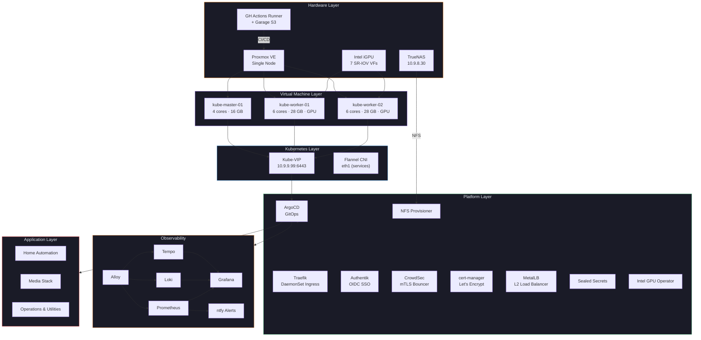
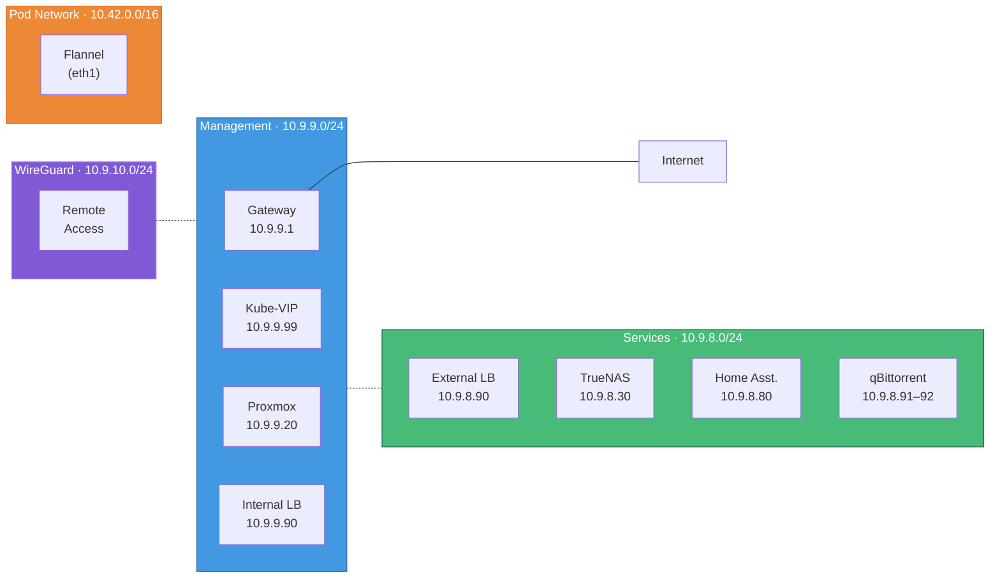
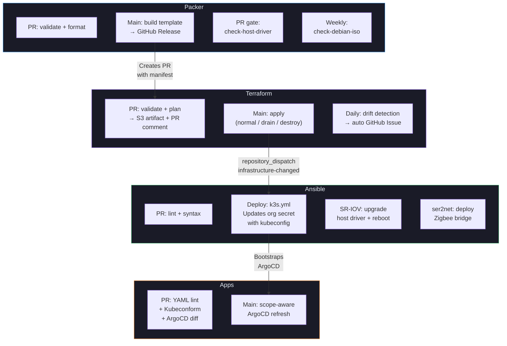

<h1 align="center">Starktastic Homelab</h1>

<p align="center">
  <b>A fully automated, GitOps-driven Kubernetes homelab — from bare-metal VM image to running application in a single pipeline.</b>
</p>

<p align="center">
  <a href="https://github.com/Starktastic-Homelab/packer/actions/workflows/build.yml"></a>
  <a href="https://github.com/Starktastic-Homelab/terraform/actions/workflows/apply.yml"></a>
  <a href="https://github.com/Starktastic-Homelab/ansible/actions/workflows/deploy.yml"></a>
</p>

<p align="center">
  
  
  
  
  
  
</p>

---

## At a Glance

This organization contains four infrastructure-as-code repositories that together form a **zero-touch pipeline** — from golden VM image creation on Proxmox VE, through Kubernetes cluster provisioning and configuration, to a self-healing GitOps application layer with full observability, SSO, intrusion detection, and hardware-accelerated media transcoding via Intel SR-IOV GPU passthrough.

Every stage triggers the next automatically. Merging a Packer PR creates a Terraform PR. Merging the Terraform PR provisions VMs and dispatches Ansible. Ansible installs K3s, bootstraps ArgoCD, and ArgoCD continuously syncs the cluster state from Git. Renovate keeps every dependency current across all four repos, including coordinated SR-IOV driver upgrades that span the hypervisor and VM template.

## End-to-End Pipeline


```mermaid
flowchart LR
    subgraph packer["1 · Packer"]
        P_ISO["Debian ISO\n+ preseed"] --> P_Build["Bootstrap\nSR-IOV · Netplan\nCloud-Init"]
        P_Build --> P_Template[("VM Template\non Proxmox")]
    end

    subgraph terraform["2 · Terraform"]
        T_Plan["Plan on PR\n+ S3 artifact"] --> T_Apply["Apply on merge"]
        T_Apply --> T_VMs["Master + Workers\nDual-NIC · GPU"]
    end

    subgraph ansible["3 · Ansible"]
        A_Init["K3s Init\n+ Kube-VIP"] --> A_Join["Join nodes\n+ GPU labels"]
        A_Join --> A_Boot["Bootstrap\nSealed-Secrets\nCert Restore\nArgoCD + OIDC"]
    end

    subgraph apps["4 · Apps"]
        Apps_Sync["ArgoCD syncs\nApplicationSets"] --> Apps_Phase["Phased rollout\nCRDs → Foundation\n→ Controllers\n→ Services"]
    end

    P_Template -- "manifest.json\ncreates PR" --> T_Plan
    T_VMs -- "repository_dispatch" --> A_Init
    A_Boot -- "bootstraps" --> Apps_Sync

    style packer fill:#1a1b27,stroke:#4299e1,color:#e2e8f0
    style terraform fill:#1a1b27,stroke:#805ad5,color:#e2e8f0
    style ansible fill:#1a1b27,stroke:#48bb78,color:#e2e8f0
    style apps fill:#1a1b27,stroke:#ed8936,color:#e2e8f0
```

## Repositories

| Repository | Description |
|------------|-------------|
| **[packer](https://github.com/Starktastic-Homelab/packer)** | Builds hardened Debian 13 VM templates on Proxmox with Intel SR-IOV DKMS drivers, cloud-init, and Netplan. Weekly ISO checks, Renovate-managed driver versions, and a merge gate that coordinates driver upgrades with Ansible. |
| **[terraform](https://github.com/Starktastic-Homelab/terraform)** | Provisions K3s VMs from the Packer template — dual-NIC networking, SR-IOV GPU passthrough for workers, S3-backed state in Garage. Plan-on-PR / apply-on-merge workflow with drift detection, drain mode, and destroy safeguards. |
| **[ansible](https://github.com/Starktastic-Homelab/ansible)** | Deploys K3s with Kube-VIP HA, joins masters and workers, pre-seeds sealed-secrets keys, restores TLS certificates from NFS backup, and installs ArgoCD with Authentik OIDC SSO. Also manages SR-IOV drivers and a Zigbee gateway on the Proxmox host. |
| **[apps](https://github.com/Starktastic-Homelab/apps)** | Declarative GitOps definitions for every cluster workload — infrastructure, monitoring, home automation, media, and utilities. ApplicationSet matrix generator with 4-phase RollingSync, Traefik ingress with CrowdSec and Authentik, full Prometheus/Grafana/Loki/Tempo observability, and scope-aware ArgoCD refresh on push. |

## Architecture


```mermaid
flowchart TB
    subgraph hw["Hardware Layer"]
        PVE["Proxmox VE\nSingle Node"]
        GPU["Intel iGPU\n7 SR-IOV VFs"]
        NAS["TrueNAS\n10.9.8.30"]
        Runner["GH Actions Runner\n+ Garage S3"]
    end

    subgraph vms["Virtual Machine Layer"]
        M["kube-master-01\n4 cores · 16 GB"]
        W1["kube-worker-01\n6 cores · 28 GB · GPU"]
        W2["kube-worker-02\n6 cores · 28 GB · GPU"]
    end

    subgraph k3s["Kubernetes Layer"]
        VIP["Kube-VIP\n10.9.9.99:6443"]
        Flannel["Flannel CNI\neth1 (services)"]
    end

    subgraph platform["Platform Layer"]
        ArgoCD["ArgoCD\nGitOps"]
        Traefik["Traefik\nDaemonSet Ingress"]
        Auth["Authentik\nOIDC SSO"]
        CrowdSec["CrowdSec\nmTLS Bouncer"]
        CertMgr["cert-manager\nLet's Encrypt"]
        MetalLB["MetalLB\nL2 Load Balancer"]
        SealedSec["Sealed Secrets"]
        NFS_Prov["NFS Provisioner"]
        IntelGPU["Intel GPU Operator"]
    end

    subgraph observe["Observability"]
        Prom["Prometheus"]
        Graf["Grafana"]
        Loki["Loki"]
        Tempo["Tempo"]
        Alloy["Alloy"]
        Ntfy["ntfy Alerts"]
    end

    subgraph services["Application Layer"]
        HA["Home Automation"]
        MediaApps["Media Stack"]
        Ops["Operations & Utilities"]
    end

    PVE --> M & W1 & W2
    GPU --> W1 & W2
    NAS -- "NFS" --> NFS_Prov
    Runner -- "CI/CD" --> PVE

    M & W1 & W2 --> VIP
    VIP --> ArgoCD
    ArgoCD --> platform & observe & services

    Alloy --> Prom & Loki & Tempo
    Prom --> Graf
    Loki --> Graf
    Tempo --> Graf
    Prom --> Ntfy

    style hw fill:#1a1b27,stroke:#e57000,color:#e2e8f0
    style vms fill:#1a1b27,stroke:#805ad5,color:#e2e8f0
    style k3s fill:#1a1b27,stroke:#4299e1,color:#e2e8f0
    style platform fill:#1a1b27,stroke:#48bb78,color:#e2e8f0
    style observe fill:#1a1b27,stroke:#ed8936,color:#e2e8f0
    style services fill:#1a1b27,stroke:#e53e3e,color:#e2e8f0
```

### Cluster Specifications

| Component | Details |
|-----------|---------|
| **Hypervisor** | Proxmox VE on a single node with Intel iGPU |
| **OS** | Debian 13 (Trixie) — Packer-built golden image |
| **Kubernetes** | K3s (lightweight, Renovate-managed version) |
| **Control Plane** | 1 master — 4 cores, 16 GB RAM, 96 GB disk |
| **Workers** | 2 nodes — 6 cores, 28 GB RAM, 96 GB disk each, SR-IOV GPU |
| **HA** | Kube-VIP — ARP-based VIP at `10.9.9.99` |
| **Storage** | TrueNAS Scale — NFS dynamic provisioning |
| **CI/CD** | Self-hosted GitHub Actions runner + Garage S3 backend |

### Network Architecture


```mermaid
graph LR
    subgraph mgmt["Management · 10.9.9.0/24"]
        GW["Gateway\n10.9.9.1"]
        VIP_N["Kube-VIP\n10.9.9.99"]
        PVE_N["Proxmox\n10.9.9.20"]
        INT_LB["Internal LB\n10.9.9.90"]
    end

    subgraph svc["Services · 10.9.8.0/24"]
        EXT_LB["External LB\n10.9.8.90"]
        NAS_N["TrueNAS\n10.9.8.30"]
        HA_LB["Home Asst.\n10.9.8.80"]
        QB_LB["qBittorrent\n10.9.8.91–92"]
    end

    subgraph vpn["WireGuard · 10.9.10.0/24"]
        WG["Remote\nAccess"]
    end

    subgraph pods["Pod Network · 10.42.0.0/16"]
        Flannel_N["Flannel\n(eth1)"]
    end

    GW --- Internet["Internet"]
    mgmt -.- svc
    vpn -.- mgmt

    style mgmt fill:#4299e1,stroke:#2b6cb0,color:#fff
    style svc fill:#48bb78,stroke:#276749,color:#fff
    style vpn fill:#805ad5,stroke:#b794f4,color:#fff
    style pods fill:#ed8936,stroke:#dd6b20,color:#fff
```

| Domain | Purpose | LoadBalancer |
|--------|---------|--------------|
| `*.starktastic.net` | Public services | `10.9.8.90` (external) |
| `*.internal.starktastic.net` | Internal-only services | `10.9.9.90` (management) |
| `*.benplus.app` | Media services | `10.9.8.90` (external) |

## Cross-Repo CI/CD Orchestration

Every repository has its own CI/CD workflows, but they're wired together to form one continuous pipeline:


```mermaid
flowchart TB
    subgraph packer_ci["Packer"]
        P_PR["PR: validate + format"]
        P_Build["Main: build template\n→ GitHub Release"]
        P_Check["PR gate:\ncheck-host-driver"]
        P_ISO["Weekly:\ncheck-debian-iso"]
    end

    subgraph terraform_ci["Terraform"]
        T_PR["PR: validate + plan\n→ S3 artifact + PR comment"]
        T_Apply["Main: apply\n(normal / drain / destroy)"]
        T_Drift["Daily: drift detection\n→ auto GitHub Issue"]
    end

    subgraph ansible_ci["Ansible"]
        A_PR["PR: lint + syntax"]
        A_Deploy["Deploy: k3s.yml\nUpdates org secret\nwith kubeconfig"]
        A_SRIOV["SR-IOV: upgrade\nhost driver + reboot"]
        A_Ser2net["ser2net: deploy\nZigbee bridge"]
    end

    subgraph apps_ci["Apps"]
        Apps_PR["PR: YAML lint\n+ Kubeconform\n+ ArgoCD diff"]
        Apps_Refresh["Main: scope-aware\nArgoCD refresh"]
    end

    P_Build -- "Creates PR\nwith manifest" --> T_PR
    T_Apply -- "repository_dispatch\ninfrastructure-changed" --> A_Deploy
    A_Deploy -- "Bootstraps\nArgoCD" --> Apps_Refresh

    style packer_ci fill:#1a1b27,stroke:#4299e1,color:#e2e8f0
    style terraform_ci fill:#1a1b27,stroke:#805ad5,color:#e2e8f0
    style ansible_ci fill:#1a1b27,stroke:#48bb78,color:#e2e8f0
    style apps_ci fill:#1a1b27,stroke:#ed8936,color:#e2e8f0
```

### Automation Highlights

| Feature | Description |
|---------|-------------|
| **Zero-Touch Pipeline** | Packer build → Terraform PR → apply → Ansible deploy → ArgoCD sync — no manual steps |
| **Renovate Everywhere** | Debian ISOs, Packer plugins, Terraform providers, K3s, Kube-VIP, Helm charts, container images, SR-IOV drivers — all auto-updated |
| **Coordinated Driver Sync** | SR-IOV driver upgrades span Ansible (host) and Packer (VM template) with a merge-order gate |
| **Drift Detection** | Daily Terraform plan detects infrastructure drift and auto-creates/closes GitHub issues |
| **Drain & Destroy Modes** | PR body checkboxes in Terraform enable safe node draining or full teardown |
| **Scope-Aware Refresh** | Apps repo CI analyzes git diffs to refresh only the affected ArgoCD applications |
| **Plan Artifact Pipeline** | Terraform plans are saved to S3, reviewed on PR, then applied exactly as previewed |
| **Kubeconfig Handoff** | Ansible uploads cluster kubeconfig as an org-level secret, enabling Terraform drift checks and apps CI |
| **Sealed Secrets** | Pre-seeded encryption keys allow encrypted secrets to be committed to Git from day one |
| **Certificate Restore** | TLS certificates backed up daily to NFS and restored during cluster bootstrap — no re-issuance delay |

## Technology Stack

| Category | Technologies |
|----------|-------------|
| **Infrastructure as Code** | Packer · Terraform · Ansible |
| **Virtualization** | Proxmox VE · Cloud-Init · QEMU/KVM |
| **Kubernetes** | K3s · Kube-VIP · Flannel · MetalLB |
| **GitOps** | ArgoCD · ApplicationSets · RollingSync |
| **Ingress & Routing** | Traefik v3 · IngressRoutes · Let's Encrypt |
| **Authentication** | Authentik · OIDC · ForwardAuth · LDAP |
| **Security** | CrowdSec · Sealed Secrets · Cloudflare DNS-01 |
| **Observability** | Prometheus · Grafana · Loki · Tempo · Alloy |
| **Alerting** | AlertManager · ntfy (self-hosted push) |
| **Storage** | TrueNAS Scale · NFS · Garage S3 |
| **GPU** | Intel SR-IOV i915 · DKMS · Intel Device Plugin Operator |
| **Databases** | PostgreSQL · Redis |
| **CI/CD** | GitHub Actions · Renovate · Cross-repo dispatch |

## Getting Started

### Prerequisites

- Proxmox VE with an Intel iGPU supporting SR-IOV
- GitHub organization with Actions enabled
- Self-hosted GitHub Actions runner
- TrueNAS or NFS-capable storage server
- Garage or S3-compatible storage for Terraform state
- DNS records for your domains

### Deployment Order

```
1. Packer    → Build the golden VM template
2. Terraform → Provision master + worker VMs
3. Ansible   → Install K3s, bootstrap ArgoCD
4. Apps      → Everything else deploys automatically via GitOps
```

After the initial deployment, the pipeline is self-sustaining — Renovate opens PRs, CI validates, and merging triggers the downstream stages automatically.

## License

All repositories are licensed under the MIT License.

---

<p align="center">
  <i>Built with &#10084;&#65039; and way too many late nights</i>
</p>
