# Starktastic Homelab

A fully automated GitOps-based Kubernetes homelab running on Proxmox VE with Intel SR-IOV GPU passthrough.

## Overview

This organization contains the infrastructure-as-code repositories that power a production-grade homelab Kubernetes cluster. The pipeline is fully automated from VM image creation to application deployment.

```mermaid
flowchart LR
    subgraph Pipeline["Automated Pipeline"]
        direction LR
        Packer["📦 Packer<br/>VM Template"]
        Terraform["🏗️ Terraform<br/>Infrastructure"]
        Ansible["⚙️ Ansible<br/>K3s Cluster"]
        Platform["🚀 Platform<br/>Applications"]
    end
    
    Packer -->|"manifest.json<br/>triggers PR"| Terraform
    Terraform -->|"repository<br/>dispatch"| Ansible
    Ansible -->|"bootstrap<br/>ArgoCD"| Platform
    
    style Packer fill:#4299e1,stroke:#2b6cb0
    style Terraform fill:#805ad5,stroke:#553c9a
    style Ansible fill:#48bb78,stroke:#276749
    style Platform fill:#ed8936,stroke:#c05621
```

## Repositories

| Repository | Description | Key Technologies |
|------------|-------------|------------------|
| [homelab-packer](https://github.com/starktastic/homelab-packer) | Debian 13 VM template with Intel SR-IOV GPU drivers | Packer, Proxmox, Cloud-Init |
| [homelab-terraform](https://github.com/starktastic/homelab-terraform) | K3s cluster VM provisioning on Proxmox | Terraform, Proxmox, MinIO |
| [homelab-ansible](https://github.com/starktastic/homelab-ansible) | K3s installation and platform bootstrapping | Ansible, K3s, Kube-VIP |
| [homelab-platform](https://github.com/starktastic/homelab-platform) | GitOps application definitions | ArgoCD, Helm, Traefik |

## Architecture

### Infrastructure Overview

| VM | Purpose | Details |
|----|---------|---------|
| **kube-master-01** | K3s Control Plane | 2 cores, 4GB RAM |
| **kube-worker-01** | K3s Worker | 6 cores, 24GB RAM, Intel GPU |
| **kube-worker-02** | K3s Worker | 6 cores, 24GB RAM, Intel GPU |
| **GitHub Actions Runner** | Self-hosted CI/CD | Runs Packer, Terraform, Ansible pipelines |
| **TrueNAS Scale** | Storage Server | NFS shares, MinIO S3, media storage |

### Cluster Specifications

| Component | Details |
|-----------|---------|
| **Hypervisor** | Proxmox VE 8.x |
| **OS** | Debian 13 (Trixie) |
| **Kubernetes** | K3s v1.35.0 |
| **Control Plane** | 1 master (2 cores, 4GB RAM) |
| **Workers** | 2 nodes (6 cores, 24GB RAM each) |
| **GPU** | Intel SR-IOV passthrough |
| **HA** | Kube-VIP (VIP: 10.9.9.99) |
| **Storage** | TrueNAS Scale (NFS + MinIO) |
| **CI/CD** | Self-hosted GitHub Actions runner |

### Network Architecture

| Network | CIDR | Purpose |
|---------|------|---------|
| Management | 10.9.9.0/24 | Cluster management, API server |
| Services | 10.9.8.0/24 | Application traffic, LoadBalancers |
| Pods | 10.42.0.0/16 | Kubernetes pod network |

### Domains

| Domain | Purpose | LoadBalancer |
|--------|---------|--------------|
| `*.starktastic.net` | Public services | 10.9.8.90 |
| `*.internal.starktastic.net` | Internal services | 10.9.9.90 |
| `*.benplus.vip` | Media services | 10.9.8.90 |

## Pipeline Flow

### 1. VM Template Creation (Packer)

- Automated Debian installation with preseed
- Intel SR-IOV DKMS driver pre-installed
- Cloud-init configured for Proxmox
- Weekly ISO update checks via GitHub Actions

### 2. Infrastructure Provisioning (Terraform)

- GitOps workflow: Plan on PR, Apply on merge
- Dynamic IP calculation from CIDR blocks
- GPU PCI passthrough for worker nodes
- Drift detection with GitHub issue creation

### 3. Cluster Configuration (Ansible)

- Dynamic inventory via Proxmox tags
- Kube-VIP for API server HA
- Sealed-secrets key pre-seeding
- ArgoCD installation with OIDC

### 4. Application Deployment (Platform)

- App-of-Apps pattern with sync waves
- Automatic ingress generation
- Authentik SSO integration
- Sealed Secrets for encrypted configs

## Key Technologies

| Category | Technologies |
|----------|-------------|
| **IaC** | Packer, Terraform, Ansible |
| **Virtualization** | Proxmox VE |
| **Kubernetes** | K3s, Kube-VIP |
| **GitOps** | ArgoCD, ApplicationSets |
| **Ingress** | Traefik, IngressRoutes |
| **Auth** | Authentik (OIDC SSO) |
| **Secrets** | Bitnami Sealed Secrets |
| **Storage** | NFS dynamic provisioning |
| **GPU** | Intel SR-IOV (i915) |
| **CI/CD** | GitHub Actions |
| **Dependencies** | Renovate |

## Automation Features

- 🔄 **Renovate** - Automated dependency updates across all repositories
- 🏗️ **GitHub Actions** - CI/CD pipelines for each repository
- 📦 **Cross-repo Dispatch** - Automatic pipeline triggering
- 🔍 **Drift Detection** - Infrastructure state monitoring
- 🔐 **Sealed Secrets** - GitOps-compatible secret management
- 🎮 **GPU Passthrough** - Hardware transcoding support

## Getting Started

### Prerequisites

- Proxmox VE 8.x cluster
- GitHub organization with Actions enabled
- MinIO or S3-compatible storage
- Self-hosted GitHub Actions runner
- DNS configured for your domains

### Deployment Order

1. **Packer** - Build the base VM template
2. **Terraform** - Provision cluster VMs
3. **Ansible** - Install K3s and bootstrap platform
4. **Platform** - Applications deploy automatically via ArgoCD

### Quick Links

- [Packer Documentation](https://github.com/starktastic/homelab-packer)
- [Terraform Documentation](https://github.com/starktastic/homelab-terraform)
- [Ansible Documentation](https://github.com/starktastic/homelab-ansible)
- [Platform Documentation](https://github.com/starktastic/homelab-platform)

## Contributing

Each repository follows its own contribution guidelines. Generally:

1. Fork the repository
2. Create a feature branch
3. Submit a pull request
4. CI/CD will validate and plan changes
5. After review, merge to apply

## License

All repositories are licensed under the MIT License.

---

  <i>Built with ❤️ for the homelab community</i>

